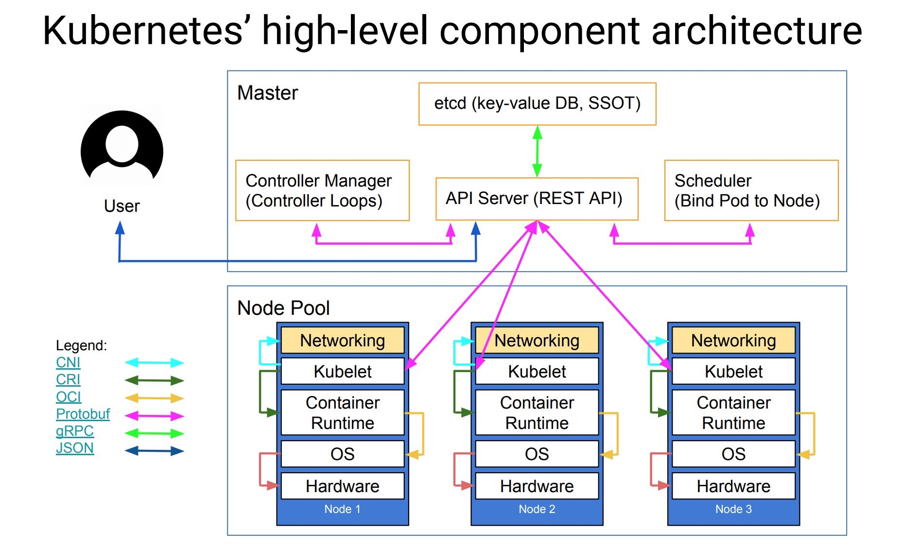
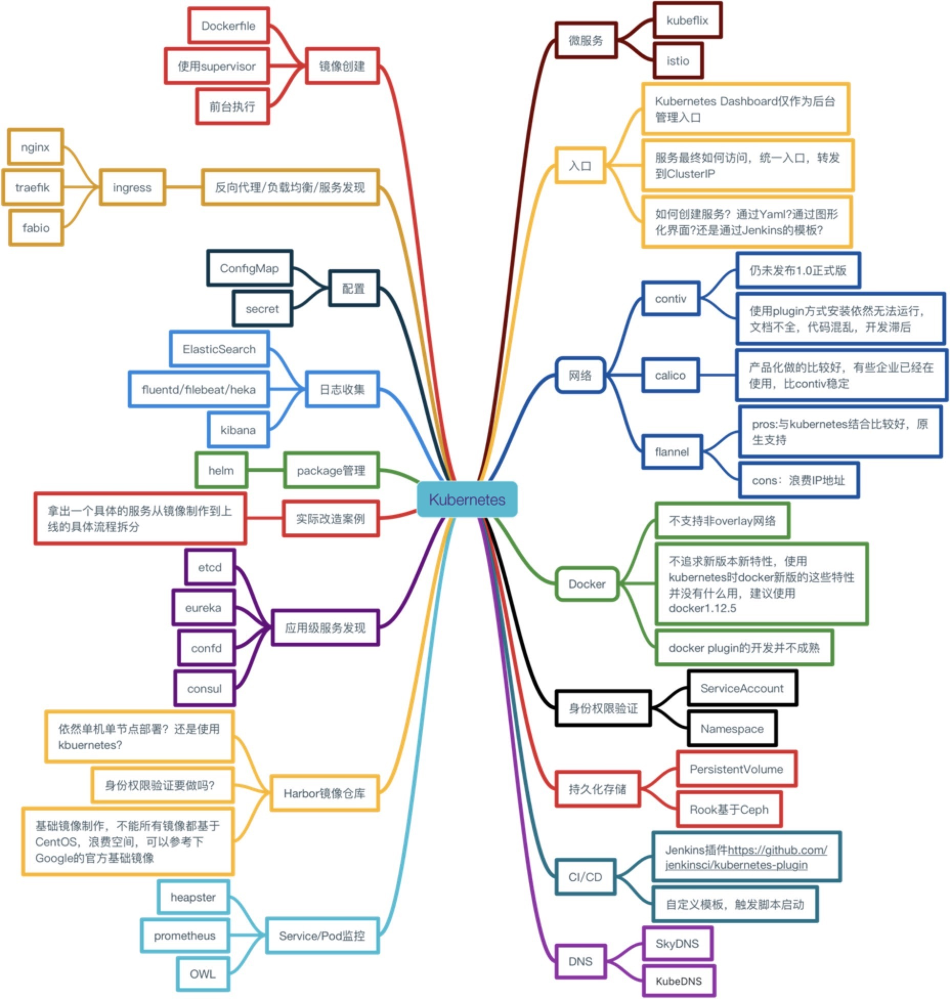

# 云原生应用之路——从Kubernetes到Cloud Native

## 容器

> 容器——Cloud Native的基石

容器最初是通过开发者工具而流行，可以使用它来做隔离的开发测试环境和持续集成环境，这些都是因为容器轻量级，易于配置和使用带来的优势，docker和docker-compose这样的工具极大的方便的了应用开发环境的搭建，开发者就像是化学家一样在其中小心翼翼的进行各种调试和开发。

容器生态图：

该生态涵盖了容器应用中从镜像仓库、服务编排、安全管理、持续集成与发布、存储和网络管理等各个方面，随着在单主机中运行容器的成熟，集群管理和容器编排成为容器技术亟待解决的问题。譬如化学家在实验室中研究出来的新产品，如何推向市场，进行大规模生产，成了新的议题。

## 为什么使用Kubernetes

> Kubernetes——让容器应用进入大规模工业生产。

**Kubernetes是容器编排系统的事实标准**

在单机上运行容器，无法发挥它的最大效能，只有形成集群，才能最大程度发挥容器的良好隔离、资源分配与编排管理的优势，而对于容器的编排管理，Swarm、Mesos和Kubernetes的大战已经基本宣告结束，Kubernetes成为了无可争议的赢家。

下面这张图是Kubernetes的架构图，其中显示了组件之间交互的接口CNI、CRI、OCI等，这些将Kubernetes与某款具体产品解耦，给用户最大的定制程度，使得Kubernetes有机会成为跨云的真正的云原生应用的操作系统。

**云原生的核心目标**

## Cloud Native

> DevOps——通向云原生的云梯

CNCF（云原生计算基金会）给出了云原生应用的三大特征：

- **容器化包装**：软件应用的进程应该包装在容器中独立运行。
- **动态管理**：通过集中式的编排调度系统来动态的管理和调度。
- **微服务化**：明确服务间的依赖，互相解耦。

云原生所需要的能力和特征。

**使用Kubernetes构建云原生应用**

我们都是知道Heroku推出了适用于PaaS的[12 factor app](https://12factor.net/)的规范，包括如下要素：

1. 基准代码
2. 依赖管理
3. 配置
4. 后端服务
5. 构建，发布，运行
6. 无状态进程
7. 端口绑定
8. 并发
9. 易处理
10. 开发环境与线上环境等价
11. 日志作为事件流
12. 管理进程

另外还有补充的三点：

- API声明管理
- 认证和授权
- 监控与告警

如果落实的具体的工具，请看下图，使用Kubernetes构建云原生架构：

结合这12因素对开发或者改造后的应用适合部署到Kubernetes之上，基本流程如下图所示：

## 使用场景

> Cloud Native的大规模工业生产

**GitOps**

给开发者带来最大的配置和上线的灵活性，践行DevOps流程，改善研发效率，下图这样的情况将更少发生。

我们知道Kubernetes中的所有应用的部署都是基于YAML文件的，这实际上就是一种**Infrastructure as code**，完全可以通过Git来管控基础设施和部署环境的变更。

## Open Source

Kubernetes调研方案选择。

