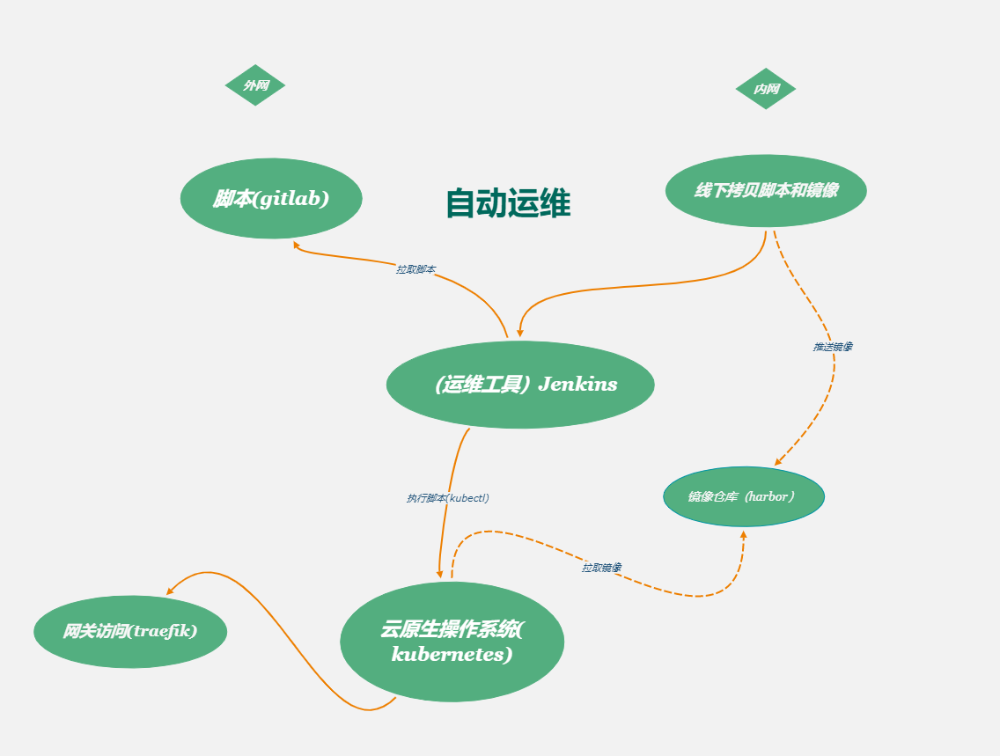

## 硬件环境

| 主机名称 | 操作系统 | 系统配置 | 备注
| :--- | --- |  --- | --- | --- |
| k8s-master1 | CentOS-7 | 8核16g |  |
| k8s-master2 | CentOS-7 | 8核16g |  |
| k8s-master3 | CentOS-7 | 8核16g |  |
| k8s-node1 | CentOS-7 | 8核16g |  |
| k8s-node2 | CentOS-7 | 8核16g |  |
| commonNode | CentOS-7 | 8核16g | 提供镜像仓库，nuget私有包，gitlab  |
## 软件环境

| 软件名称 | 版本 | 介绍 | 
| :--- | --- |  --- | --- | 
| gitlab | 11.0.1-ce.0 | 代码托管平台,用来管理开发人员提交的代码。
| jenkins | jenkins/jenkins:lts | 用于持续、自动的构建/测试软件项目。
| kubernetes| 1.18.13 | 现容器集群的自动化部署、自动扩缩容、维护,等于云原生操作系统。
| harbor|  2.1.2 | 开源的容器镜像仓库,这里用来管理项目编排的所有镜像。
| traefik|1.7.28| 一个云原生的新型的 HTTP 反向代理、负载均衡软件。
 
## 基础环境配置
 1. 参照文档在[CentOS上部署kubernetes集群](https://en-en.github.io/DevOps.github.io/practice/install-kubernetes-on-centos.html),配置完成构建快照，这里为基础软件环境。

## 准备工作

 1. 各个物理机基础软件环境皆由同华提供快照来搭建(所有物理机基础软件环境一致)。
 2. 集群扩展节点脚本由同华提供(随着业务流量增加，需要横向扩展集群来提供更强大的负载功能，这里负载没有上线)。

## 集群目标
 1. 实现所有服务高可用，在服务器宕机后，不间断的提供服务。
 2. 实现集群对大数据，大流量支持(通过扩展节点方式可以很轻松的增加整个集群的负载能力)。
 3. 实现异常信息迅速定位(集群层次的日志，报警，监控).
 4. 实现强大的自愈能力，问题被修复后，集群能自动将服务重新安装期望的状态运行。
 5. 极大简化运维人员工作。

## 运维工作
  

  
  **内网操作**

 1. 运维人员从线下渠道获取项目发布脚本和镜像
 2. 运维人员将镜像推送到镜像仓库中
 3. 运维人员通过运维工具(jenkins)执行脚本
 4. 部署完成

  **外网操作**
 1. 运维人员通过运维工具(jenkins)运执行脚本
 2. 部署完成