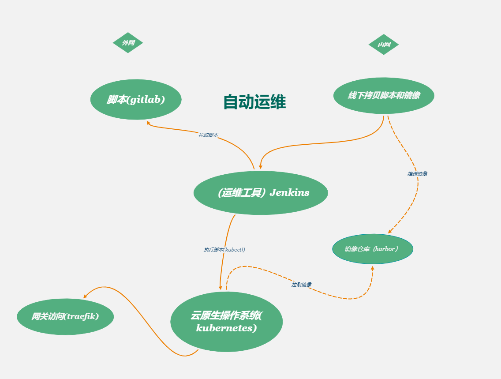

## 初衷
 随着使用用户的增多和业务功能的推进，对服务的管理和集群的性能要求逐渐增高，现有结构已经不能满足这个要求，并且它无法进行扩展，所以一个高度扩展的集群是必须的。

## 现有环境对比

## 硬件环境

| 主机名称 | 操作系统 | 系统配置 | 备注 |
| :--- | --- |  --- | --- | 
| k8s-master1 | CentOS-7 | 8核16g |  |
| k8s-master2 | CentOS-7 | 8核16g |  |
| k8s-master3 | CentOS-7 | 8核16g |  |
| k8s-node1 | CentOS-7 | 8核16g |  |
| k8s-node2 | CentOS-7 | 8核16g |  |
| commonNode | CentOS-7 | 8核16g | 提供镜像仓库，nuget私有包，gitlab  |

 当前环境所有资源都部署在一台8核8g虚拟中。

## 方案选择

使用Kubernetes构建云原生架构：

Kubernetes调研方案选择。

以kubernete为核心，实现云原生应用部署。

运维流程图

## 内网操作

 1. 运维人员从线下渠道获取项目发布脚本和镜像
 2. 运维人员将镜像推送到镜像仓库中
 3. 运维人员通过运维工具(jenkins)执行脚本
 4. 部署完成

## 外网操作
 1. 运维人员通过运维工具(jenkins)运执行脚本
 2. 部署完成

## 为什么要使用kubernetes

## 对于开发人员
  
  

 * 由于公司业务多，开发环境、测试环境和生产环境都是隔离的，在没有用k8s的时候，查看线下测试的日志，需要开发或者测试人员，找到对应的ip，然后才能查看日志，在用了k8s之后，开发和测试可以直接在k8s的dashboard到对应的namespace，即可定位到业务的容器，然后可以直接通过控制台查看到对应的日志，大大降低了操作时间。
 * 把应用部署到k8s之后，代码的发布、回滚都变得特别简单,不仅加快了业务代码迭代的速度，而且全程无需人工干预。目前我们使用jenkins进行发版或者回滚等，从开发环境到测试环境，到最后的生产环境，完全遵守一次构建，多集群、多环境部署，通过不同的启动参数、不同的环境变量、不同的配置文件实现区分不同的环境。
 * 在使用服务网格后，开发人员在开发应用的过程中，不用再关心代码的网络部分，这些功能都被服务网格实现，让开发人员可以只关心代码逻辑部分，即可实现网络部分的功能，比如：断流、分流、路由、负载均衡、限速和触发故障等功能。
 * 测试过程中，可能同时多套环境，当然也会需要再创建一套测试环境，之前测试环境的创建，需要找运维或者自行手工搭建。在迁移至k8s集群后,只需要一个命令即可。

## 对于运维人员
 
   

 * 可能经常有很多重复、繁琐的工作感觉。比如：这个需要一套新的测试环境，那个需要一套新的测试环境，之前可能需要装系统、装依赖环境、开通权限等等。而如今，可以直接用镜像直接部署一套新的测试环境，甚至全程无需自己干预，开发人员通过jenkins或者自动化运维平台即可一键式创建，大大降低了运维成本。
 * 公司业务故障，可能是因为基础环境不一致、依赖不一致、端口冲突等等问题，现在实现镜像部署，所有的依赖、基础都是一样的，大大减少了因为这类基础问题引发的故障。也有可能公司业务是由于服务器宕机、网络等问题，造成服务不可用，此类情况均需要运维人员及时去修复，而如今，可能在你收到告警信息的时候，k8s已经帮你恢复了。
 * 在没有使用k8s时，业务应用的扩容和缩容，都需要人工去处理，从采购服务器、上架、到部署依赖环境，不仅需要大量的人力物力，而且非常容易在中间过程出现问题，又要花费大量的时间去查找问题。成功上架后，还需要在前端反代端添加或该服务器，而如今，可以利用k8s的弹性计算，一键式进行扩容和缩容，不仅大大提高了运维效率，而且还节省了不少的服务器资源，提高了资源利用率。
 * 对于负载均衡方面，之前负载均衡可能是Nginx、LVS、HAProxy、F5等，云上可能是云服务商提供的负载均衡机制。每次添加删除节点时，都需要手动去配置前端负载均衡，手动去匹配后端节点，而如今，使用k8s内部的service可以动态发现实现自动管理节点，并且支持自动扩容缩容。之前遇到高峰流量时，经常服务器性能不够，需要临时加服务器面对高峰流量，而如今对于高性能k8s集群，无需管理，自动扩容。
 * 对于中间件搭建方面，根据定义好的deploy文件，可以实现秒级搭建各类中间件高可用集群，如Redis、RabbitMQ等，并且大大减少了出错的概率。
 * 对于应用端口方面，以前环境中，一个服务器可能跑了很多进程，每个进程都有一个端口，需要人为的去配置端口，并且还需要考虑端口冲突的问题，如果有防火墙的话，还需要配置防火墙，在k8s中，端口统一管理，统一配置，每个应用的端口都可设置成一样的，之后通过service进行负载均衡。
 * 对于高可用方面，k8s天生的高可用功能，彻底释放了双手，无需再去创建各类高可用工具、检测检查脚本。k8s支持进程级别的健康检查，如发现接口超时或者返回值不正确，会自动处理该问题。
  

## 总结
  新的集群使用云原生理念，kubernetes作为其操作系统，依赖于这个强大的容器编排调度引擎，我们描述集群的架构，定义服务的最终状态，kubernetes将系统自动得达到和维持在这个状态。整个集群高度扩展，同时负载能力没有上线，只需要简单的增加节点机器，即可提高整个集群的负载能力。

 
  
 