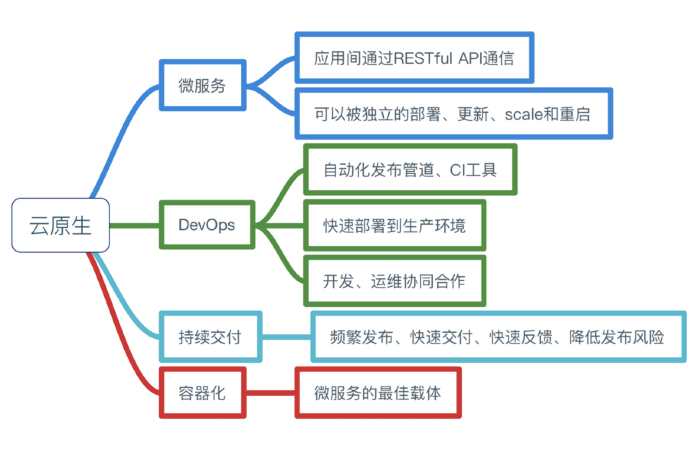
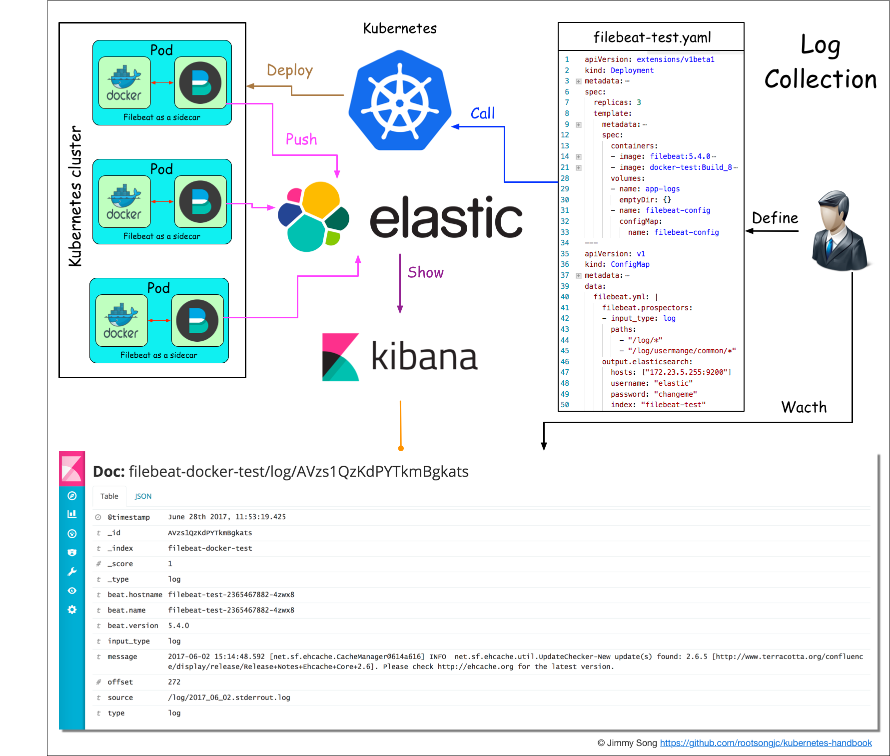
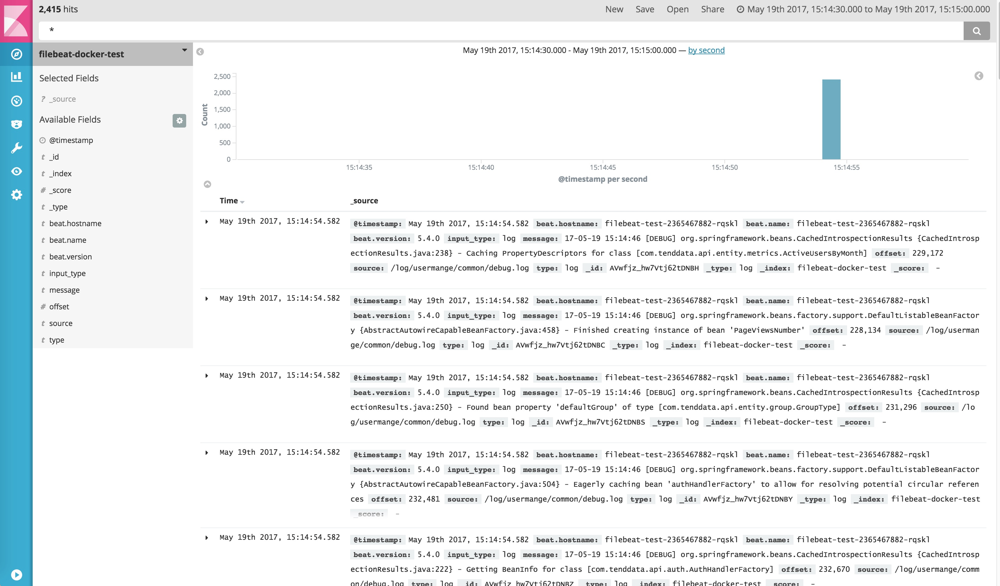

### 微服务介绍

微服务（Microservices）这个词比较新颖，但是其实这种架构设计理念早就有了。微服务是一种分布式架构设计理念，为了推动细粒度服务的使用，这些服务要能协同工作，每个服务都有自己的生命周期。一个微服务就是一个独立的实体，可以独立的部署在PAAS平台上，也可以作为一个独立的进程在主机中运行。服务之间通过API访问，修改一个服务不会影响其它服务。

### 云原生概念介绍

下面是Cloud Native概念思维导图

为了解决传统应用升级缓慢、架构臃肿、不能快速迭代、故障不能快速定位、问题无法快速解决等问题，云原生这一概念横空出世。

另外，云原生也很好地解释了云上运行的应用应该具备什么样的架构特性——敏捷性、可扩展性、故障可恢复性。

云原生应用应该具备以下几个关键词：

* 敏捷
* 可靠
* 高弹性
* 易扩展
* 故障隔离保护
* 不中断业务持续更新

## Kubernetes与云原生的关系

Kuberentes可以说是乘着Docker和微服务的东风，一经推出便迅速蹿红，它的很多设计思想都契合了微服务和云原生应用的设计法则。

### Kubernetes介绍

[Kubernetes](http://kubernetes.io)是Google基于[Borg](https://research.google.com/pubs/pub43438.html)开源的容器编排调度引擎，作为[CNCF](http://cncf.io)（Cloud Native Computing Foundation）最重要的组件之一，它的目标不仅仅是一个编排系统，而是提供一个规范，可以让你来描述集群的架构，定义服务的最终状态，Kubernetes可以帮你将系统自动得达到和维持在这个状态。

更直白的说，Kubernetes用户可以通过编写一个yaml或者json格式的配置文件，也可以通过工具/代码生成或直接请求Kubernetes API创建应用，该配置文件中包含了用户想要应用程序保持的状态，不论整个Kubernetes集群中的个别主机发生什么问题，都不会影响应用程序的状态，你还可以通过改变该配置文件或请求Kubernetes API来改变应用程序的状态。

### 12因素应用

**1.基准代码**

每个代码仓库（repo）都生成docker image保存到镜像仓库中，并使用唯一的ID管理，在Jenkins中使用编译时的ID。

**2.依赖**

显式的声明代码中的依赖，使用软件包管理工具声明，比如Go中的Glide。

**3.配置**

将配置与代码分离，应用部署到Kubernetes中可以使用容器的环境变量或ConfigMap挂载到容器中。

**4.后端服务**

把后端服务当作附加资源，实质上是计算存储分离和降低服务耦合，分解单体应用。

**5.构建、发布、运行**

严格分离构建和运行，每次修改代码生成新的镜像，重新发布，不能直接修改运行时的代码和配置。

**6.进程**

应用程序进程应该是无状态的，这意味着再次重启后还可以计算出原先的状态。

**7.端口绑定**

在Kubernetes中每个Pod都有独立的IP，每个运行在Pod中的应用不必关心端口是否重复，只需在service中指定端口，集群内的service通过配置互相发现。

**8.并发**

每个容器都是一个进程，通过增加容器的副本数实现并发。

**9.易处理**

快速启动和优雅终止可最大化健壮性，Kuberentes优秀的[Pod生存周期控制](https://jimmysong.io/posts/pod-lifecycle/)。

**10.开发环境与线上环境等价**

在Kubernetes中可以创建多个namespace，使用相同的镜像可以很方便的复制一套环境出来，镜像的使用可以很方便的部署一个后端服务。

**11.日志**

把日志当作事件流，使用stdout输出并收集汇聚起来，例如到ES中统一查看。

**12.管理进程**

后台管理任务当作一次性进程运行，`kubectl exec`进入容器内部操作。

### 容器的设计模式

Kubernetes提供了多种资源对象，用户可以根据自己应用的特性加以选择。这些对象有：

| 类别 | 名称 |
| :--- | --- |
| 资源对象 | Pod、ReplicaSet、ReplicationController、Deployment、StatefulSet、DaemonSet、Job、CronJob、HorizontalPodAutoscaler |
| 配置对象 | Node、Namespace、Service、Secret、ConfigMap、Ingress、Label、CustomResourceDefinition、   ServiceAccount |
| 存储对象 | Volume、Persistent Volume |
| 策略对象 | SecurityContext、ResourceQuota、LimitRange |

### 资源限制与配额

两层的资源限制与配置

* Pod级别，最小的资源调度单位
* Namespace级别，限制资源配额和每个Pod的资源使用区间

### 部署Kubernetes集群

使用二进制部署 `kubernetes` 集群的所有组件和插件。
**集群详情**

* Kubernetes 1.6.0
* Docker 1.12.5（使用yum安装）
* Etcd 3.1.5
* Flanneld 0.7 vxlan 网络
* TLS 认证通信 \(所有组件，如 etcd、kubernetes master 和 node\)
* RBAC 授权
* kubelet TLS BootStrapping
* kubedns、dashboard、heapster\(influxdb、grafana\)、EFK\(elasticsearch、fluentd、kibana\) 集群插件
* 私有Docker镜像仓库[Harbor](https://github.com/vmware/harbor)

**步骤介绍**

1. [创建 TLS 证书和秘钥](../practice/create-tls-and-secret-key.md)
2. [创建kubeconfig文件](../practice/create-kubeconfig.md)
3. [创建高可用etcd集群](../practice/etcd-cluster-installation.md)
4. [安装kubectl命令行工具](../practice/kubectl-installation.md)
5. [部署master节点](../practice/master-installation.md)
6. [安装flannel网络插件](../practice/flannel-installation.md)
7. [部署node节点](../practice/node-installation.md)
8. [安装kubedns插件](../practice/kubedns-addon-installation.md)
9. [安装dashboard插件](../practice/dashboard-addon-installation.md)
10. [安装heapster插件](../practice/heapster-addon-installation.md)
11. [安装EFK插件](../practice/efk-addon-installation.md)

### 服务发现与负载均衡

* **Service**：直接用Service提供cluster内部的负载均衡，并借助cloud provider提供的LB提供外部访问
* **Ingress**：还是用Service提供cluster内部的负载均衡，但是通过自定义LB提供外部访问
* **Service Load Balancer**：把load balancer直接跑在容器中，实现Bare Metal的Service Load Balancer
* **Custom Load Balancer**：自定义负载均衡，并替代kube-proxy，一般在物理部署Kubernetes时使用，方便接入公司已有的外部服务

### 持续集成与发布

应用构建和发布流程说明：

1. 用户向Gitlab提交代码，代码中必须包含`Dockerfile`
2. 将代码提交到远程仓库
3. 用户在发布应用时需要填写git仓库地址和分支、服务类型、服务名称、资源数量、实例个数，确定后触发Jenkins自动构建
4. Jenkins的CI流水线自动编译代码并打包成Docker镜像推送到Harbor镜像仓库
5. Jenkins的CI流水线中包括了自定义脚本，根据我们已准备好的Kubernetes的YAML模板，将其中的变量替换成用户输入的选项
6. 生成应用的Kubernetes YAML配置文件
7. 更新Ingress的配置，根据新部署的应用的名称，在Ingress的配置文件中增加一条路由信息
8. 更新PowerDNS，向其中插入一条DNS记录，IP地址是边缘节点的IP地址。
9. Jenkins调用Kubernetes的API，部署应用

### 日志收集与监控

，选用[filebeat](https://www.elastic.co/products/beats/filebeat)来收集日志。

### 安全性与权限管理

Kubernetes是一个多租户的云平台，因此必须对用户的权限加以限制，对用户空间进行隔离。Kubernetes中的隔离主要包括这几种：

* 网络隔离：需要使用网络插件，比如[flannel](https://coreos.com/flannel/), [calico](https://www.projectcalico.org/)。
* 资源隔离：kubernetes原生支持资源隔离，pod就是资源隔离和调度的最小单位，同时使用[namespace](https://jimmysong.io/kubernetes-handbook/concepts/namespace.html)限制用户空间和资源限额。
* 身份隔离：使用[RBAC-基于角色的访问控制](https://jimmysong.io/kubernetes-handbook/guide/rbac.html)，多租户的身份认证和权限控制。

### DevOps

下面是社区中Kubernetes开源爱好者的分享内容，我觉得是对Kubernetes在DevOps中应用的很好的形式值得大家借鉴。

真正践行DevOps，让开发人员在掌握自己的开发和测试环境，让环境一致，让开发效率提升，让运维没有堆积如山的tickets，让监控更加精准，从Kubernetes平台开始。

**行动指南**

1. 根据环境（比如开发、测试、生产）划分`namespace`，也可以根据项目来划分
2. 再为每个用户划分一个`namespace`、创建一个`serviceaccount`和`kubeconfig`文件，不同`namespace`间的资源隔离，目前不隔离网络，不同`namespace`间的服务可以互相访问
3. 创建yaml模板，降低编写Kubernetes yaml文件编写难度
4. 在`kubectl`命令上再封装一层，增加用户身份设置和环境初始化操作，简化`kubectl`命令和常用功能
5. 管理员通过dashboard查看不同`namespace`的状态，也可以使用它来使操作更便捷
6. 所有应用的日志统一收集到ElasticSearch中，统一日志访问入口
7. 可以通过Grafana查看所有namespace中的应用的状态和kubernetes集群本身的状态
8. 需要持久化的数据保存在分布式存储中，例如GlusterFS或Ceph中

**使用Kibana查看日志**

日志字段中包括了应用的标签、容器名称、主机名称、宿主机名称、IP地址、时间。

**使用Grafana查看应用状态**

监控分类示意图：

Kubernetes集群全局监控图1

该监控图可以看到集群硬件使用情况。

Kubernetes全局监控图2

该监控可以看到单个用户的namespace下的所有资源的使用情况。

