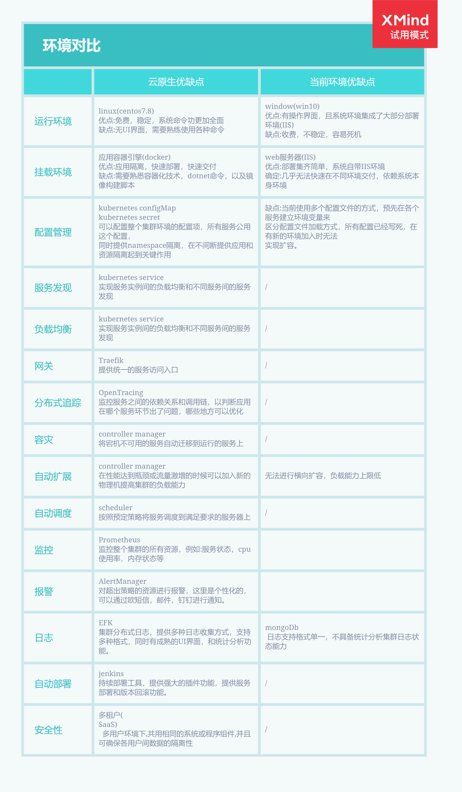
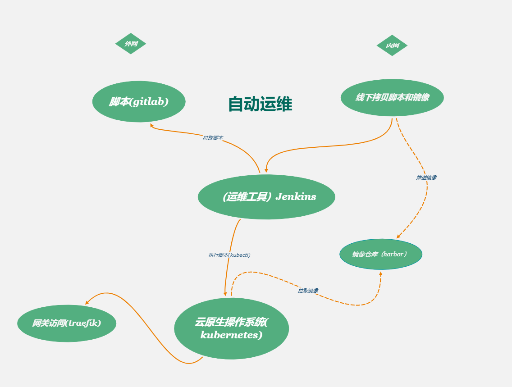

## 初衷
 随着使用用户的增多和业务功能的推进，对服务的管理和集群的性能要求逐渐增高，现有结构已经不能满足这个要求，并且他无法进行扩展，所以一个高度扩展的集群是必须的。

 现有环境对比

使用Kubernetes构建云原生架构：

Kubernetes调研方案选择。

运维流程图

 ## 总结
  新的集群使用云原生理念，kubernetes作为其操作系统，依赖于这个强大的容器编排调度引擎，我们描述集群的架构，定义服务的最终状态，kubernetes将系统自动得达到和维持在这个状态。

 
  
 