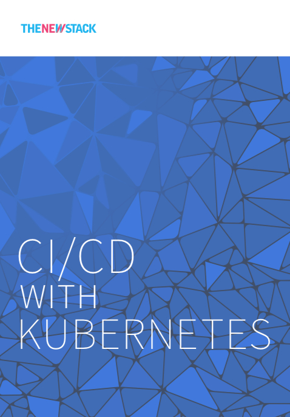

# 持续集成与发布

持续集成与发布，简称CI/CD，是微服务构建的重要环节，也是DevOps中推崇的方法论。如何在kubernetes中使用持续构建与发布工具？可以既可以与企业内部原有的持续构建集成，例如Jenkins，也可以在kubernetes中部署一套新的持续构建与发布工具，例如Drone。

众所周知Kubernetes并不提供代码构建、发布和部署，所有的这些工作都是由CI/CD工作流完成的，最近TheNewStack又出了本小册子（117页）介绍了Kubernetes中CI/CD的现状。下载本书的PDF请访问：https://thenewstack.io/ebooks/kubernetes/ci-cd-with-kubernetes/

这本小册子里主要主要介绍了以下几点：

- DevOps模式
- 云原生应用模式
- 使用Spinnaker做持续交付
- 云原生时代的监控

### DevOps模式

自动化运维工具Docker和DevOps，将容器如何解除开发和运维之间的隔阂，但同时也带来了一些挑战，比如频繁的发布变更如何控制，如何控制容器集群的行为，如何拆分应用到容器之中等。这是一个专门用于容器编排调度的工具呼之欲出，Kubernetes的出现彻底改变了局面，可以说它直接改变了应用的基础架构。

Kubernetes细化的应用程序的分解粒度，同时将服务发现、配置管理、负载均衡和健康检查等作为基础设施的功能，简化了应用程序的开发。

而Kubernetes这种声明式配置尤其适合CI/CD流程，况且现在还有如Helm、Draft、Spinnaker、Skaffold等开源工具可以帮助我们发布Kuberentes应用。

有了基于Kubernetes的CI/CD流程后，又诞生了GitOps（<https://www.weave.works>的博客中有很多相关文章）和SecOps（Security Operation）。

### 云原生应用模式

> 云原生是通过构建团队、文化和技术，利用自动化和架构来管理系统的复杂性和解放生产力。——Joe Beda，Heotio CTO，联合创始人

云原生应用的10条关键属性。

1. 使用轻量级的容器打包
2. 使用最合适的语言和框架开发
3. 以松耦合的微服务方式设计
4. 以API为中心的交互和协作
5. 无状态和有状态服务在架构上界限清晰
6. 不依赖于底层操作系统和服务器
7. 部署在自服务、弹性的云基础设施上
8. 通过敏捷的DevOps流程管理
9. 自动化能力
10. 通过定义和策略驱动的资源分配

总结概括为以下10条：

1. 不要直接部署裸的Pod。
2. 为工作负载选择合适的Controller。
3. 使用Init容器确保应用程序被正确的初始化。
4. 在应用程序工作负载启动之前先启动service。
5. 使用Deployment history来回滚到历史版本。
6. 使用ConfigMap和Secret来存储配置。
7. 在Pod里增加Readiness和Liveness探针。
8. 给Pod设置CPU和内存资源限额。
9. 定义多个namespace来限制默认service范围的可视性。
10. 配置HPA来动态扩展无状态工作负载。
